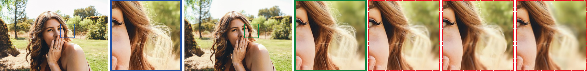
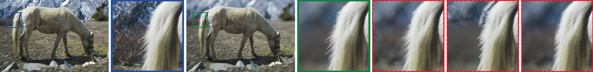
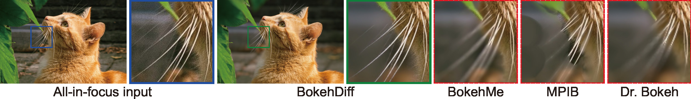

# BokehDiff: Neural Lens Blur with One-Step Diffusion





- A physics-inspired self-attention (PISA) module design that aligns with the image formation process, incorporating depth-dependent circle of confusion constraint and self-occlusion effects. 
- A one-step inference scheme to exploit the diffusion prior, without introducing additional noise.
- A scalable paired data synthesis scheme, combining AIGC photorealistic foregrounds with transparency and conventional all-in-focus background images, balancing authenticity and scene diversity.

[[Paper](https://drive.google.com/file/d/1CYNf7-HTmwdLbW4rjnDUqg6o62MLN-TL/view?usp=sharing)]

The dataset synthesis is now performed on-the-fly, which means it only needs to take foreground images (with transparency) and background images as input, and the images with lens blur will be generated in `dataset.py` in parallel with training.

## Quick start
To initiate the environment, run the following scripts
```bash
conda create -n bokehdiff python=3.10 peft transformers kornia pillow scikit-image piq lpips accelerate safetensors cupy xformers -c pytorch -c nvidia -c conda-forge
conda activate bokehdiff
pip install diffusers==0.32.1
pip install uv
uv pip install torch torchvision
```

After properly setting up the environment, we use [Depth-Anything-V2](https://github.com/DepthAnything/Depth-Anything-V2) and [BiRefNet](https://github.com/ZhengPeng7/BiRefNet) to prepare the data, by
```bash
python prepare_data.py
```

Now the exemplar data folder should have contain the depth and salient mask prediction results.

### Inference
```bash
python inference_hf.py --test_data_dir "test_data/input/*" --output_dir bokehdiff_test --enable_xformers_memory_efficient_attention --data_id demo --K 20
```
The script above renders the prepared data, and saves the results to `bokehdiff_test/demo/`, with a bokeh strength of 20.

### Training
For training, foreground data with transparency is needed, to synthesize the image with lens blur effects on-the-fly. I'll provide more details about this part when I have more spare time. 😢
If you already have some data in hand, you can place the foreground (PNG files w/transparency) and background (ordinary images, all-in-focus) in two folders of `<data_root>/fg/` and `<data_root>/bg/`. You should specify `<data_root>` when running the training script:
```bash
mkdir logs_bokehdiff
python train_lora_otf.py --train_data_dir <data_root> \
--pretrained_model_name_or_path SG161222/RealVisXL_V5.0 \
--train_batch_size 1 --output_dir logs_bokehdiff \
--mixed_precision no --opt_vae 1 \
--max_train_steps 120000 --enable_xformers_memory_efficient_attention \
--learning_rate 5e-5 --lr_scheduler cosine --lr_num_cycles 1 \
--lr_warmup_steps 20 --resolution 512 \
--lpips --edge --lambda_lpips 5 --checkpointing_steps 60000 \
--gan_loss_type multilevel_sigmoid_s --cv_type convnext \
--lambda_gan 0.1 --gan_step 30000
```


## Citation
If you find our work useful to your research, please cite our paper as:
```
@inproceedings{zhu2025bokehdiff,
  title = {BokehDiff: Neural Lens Blur with One-Step Diffusion},
  author = {Zhu, Chengxuan and Fan, Qingnan and Zhang, Qi and Chen, Jinwei and Zhang, Huaqi and Xu, Chao and Shi, Boxin},
  booktitle = {IEEE International Conference on Computer Vision},
  year = {2025}
}
```
Feel free to [contact me](https://freebutuselesssoul.github.io/) if you're also interested in the possibility of combining AIGC with photography.
